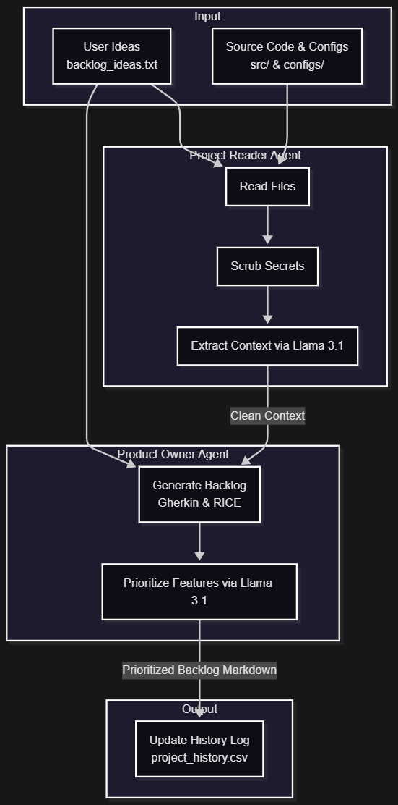
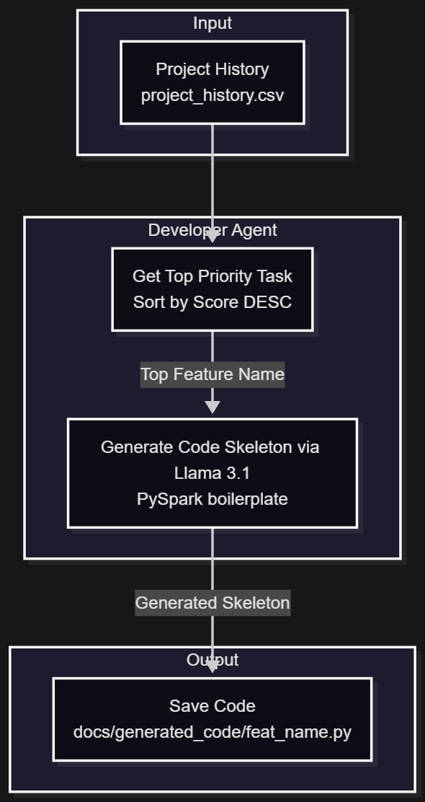
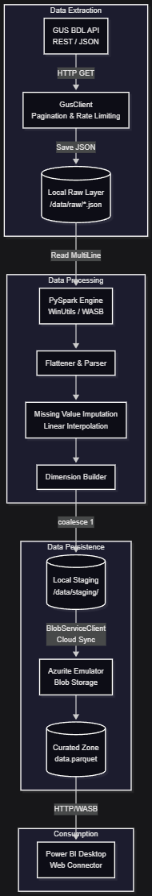
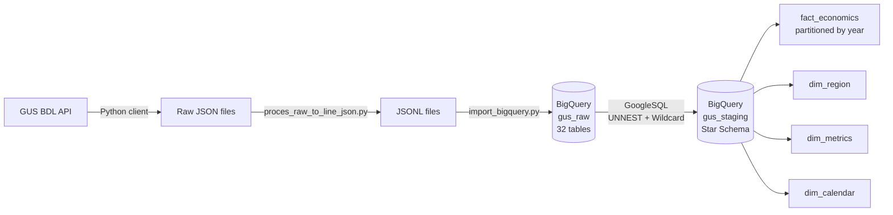
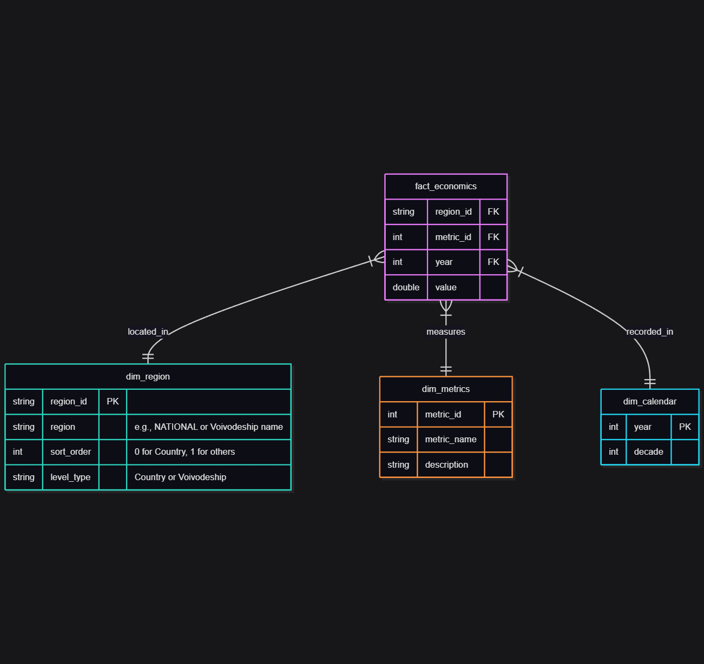

# Local E2E Data Engineering Project: Polish Economic Analysis

### 📺 Project Overview [Video]

## Project Overview
This project demonstrates a comprehensive, end-to-end data engineering pipeline built entirely in a local environment to simulate a production cloud-scale architecture. The system seamlessly integrates data extraction from the Statistics Poland (GUS) BDL API, complex PySpark transformations (including linear interpolation for missing data), multi-layered Azure Blob Storage simulation (Azurite), and enterprise-grade Power BI visualization. Additionally, the project features a cutting-edge Proof of Concept (PoC) for agentic workflows, utilizing local LLMs (Llama 3.1) for automated backlog generation, prioritization, and code scaffolding.

**Key Technical Pillars:**
* **Cloud Simulation:** Full Azure Data Lake simulation using Azurite (Blob Storage) and local PySpark on Windows.
* **Local LLM Integration:** Powered by **Ollama** and **Llama 3.1**, allowing for private, offline project orchestration and decision-making.
* **Infrastructure Portability:** Automated environment normalization (WinUtils/Hadoop integration) for seamless execution across multiple machines (Laptop/Desktop).
* **Data Quality & Imputation:** Advanced transformation logic implementing linear interpolation to fill data gaps or confidential records (e.g., Opolskie 2023).
* **Professional Tooling:** Strict enforcement of code style using **Black** (formatter) and **Flake8** (linter), with unit tests powered by **Pytest**.
* **Business Intelligence:** Enterprise-grade Power BI reporting featuring a Bento Grid layout, multi-page navigation, and dynamic DAX narratives.

### 📊 Dashboard Preview
**Page 1: Executive Summary**

**Page 2: Regional Map**

## 🤖 Agentic Orchestration & AI Development

> [!WARNING]
> **Conceptual Proof of Concept:** The agentic system implemented in this project is an experimental layer designed to explore AI-driven project management. Local models (Llama 3.1 8B) used for the **Developer Agent** are prone to hallucinations (e.g., inventing non-existent PySpark methods like `checkSchema`). They serve as a "Stochastic Parrot" to demonstrate the *potential* of automation, not as a reliable production-ready code generator in this scenario.

The project features a **local Multi-Agent System** that acts as a technical co-pilot for project management and requirements engineering:

* **Analyst Agent:** Performs deep-scans of source code, infrastructure scripts (Azurite), and configuration files. It includes a **Secret Scrubber** to redact sensitive keys (like in `settings.json`) before processing.
* **Product Owner Agent:** Transforms raw ideas into **Gherkin-compliant User Stories** and prioritizes them using the **RICE Framework**.
* **Developer Agent (PoC):** Generates PySpark code skeletons based on prioritized tasks to demonstrate automated development workflows.
* **Performance Monitoring:** Every agentic interaction is measured (Performance Monitor) to optimize execution across different hardware profiles (**RTX 5070 Ti** vs **RTX 3070 Laptop**).

### Agent Workflows
**Phase 1: Context & Backlog Generation** 

**Phase 2: Code Generation** 

## Architecture & Workflow
1. **Source:** Statistics Poland API (GUS BDL).
2. **Ingestion (Extract):** Python-based client with pagination handling and rate-limiting, persisting raw JSON telemetry.
3. **Storage (Data Lake):** Azurite Blob Storage Emulator organized into `raw`, `staging`, and `curated` zones.
4. **Processing (Transform):** Apache Spark (PySpark) executing:
   * Hierarchical JSON flattening.
   * **Data Imputation:** Linear interpolation for missing/confidential data (`attr_id != 1`).
   * Relational modeling (Star Schema).
5. **Serving (Load):** Final assets stored as Parquet files with static URI mapping (`data.parquet`) for stable BI connectivity.
6. **AI Prioritization Loop:** Automated backlog generation where tasks are scored via RICE:
   $$RICE = \frac{Reach \times Impact \times Confidence}{Effort}$$
7. **Visualization:** Power BI Desktop connected via HTTP/WASB, featuring dynamic trend analysis and regional benchmarking.

## Architecture Diagram

## ☁️ Cloud Deployment (BigQuery)

The local pipeline architecture was replicated on Google Cloud Platform to demonstrate production-grade cloud deployment. The core transformation logic was re-implemented in **GoogleSQL on BigQuery**, replacing the local PySpark layer while preserving the same star schema structure and data quality standards.

**Key Cloud Components:**
* **Google Cloud Storage:** Raw JSONL files uploaded as the ingestion landing zone, mirroring the local Azurite Bronze layer.
* **BigQuery (`gus_raw`):** 32 raw tables loaded from JSONL, preserving the original nested JSON structure (`RECORD REPEATED`) from the GUS API responses.
* **BigQuery (`gus_staging`):** Star schema replicated using GoogleSQL — `fact_economics` built via wildcard table scan (`gus_raw.*`) with `UNNEST` for nested array flattening, partitioned by year and clustered by `region_id` and `metric_id`.
* **Python Ingestion Scripts:** `src/bigquery/proces_raw_to_line_json.py` converts raw JSON to JSONL format; `src/bigquery/import_bigquery.py` loads all files to BigQuery using the `google-cloud-bigquery` client — both driven by `configs/dev/settings.json`.
* **Service Account:** IAM-managed credentials with `BigQuery Data Editor` and `BigQuery Job User` roles for secure programmatic access.

**GoogleSQL vs PySpark — Key Differences:**
* `UNNEST()` replaces `explode()` for nested array flattening
* Wildcard tables (`gus_raw.*`) replace manual `unionByName` across DataFrames
* `RANGE_BUCKET` partitioning replaces Parquet file partitioning
* `DATE_DIFF()` and `DATE_TRUNC()` replace PySpark date functions

## Data Scope
The pipeline monitors a comprehensive set of indicators across 16 Voivodeships:
* **Labor Market:** Average Gross Wages, Registered Unemployment Rate.
* **Living Standards:** Disposable Income vs. Expenditures per capita.
* **Macroeconomics:** GDP per capita, Total GDP, Investment Outlays.
* **Housing Market:** Residential Price per m2, Dwellings Completed, Market Transactions Volume.
* **Public Finance & Business:** Budget Revenues/Expenditures, Business Entities per 10k population.

## Directory Structure
* `data/`: Raw (JSON), Staging (Parquet), Processed (intermediate Parquet), Curated data layers, and `bq_ready/` (JSONL files for BigQuery ingestion).
* `src/pyspark/`: Core ETL logic (Main orchestrator, Spark setup, GUS client, Transformers).
* `src/bigquery/`: Google Cloud pipeline scripts — JSONL conversion (`proces_raw_to_line_json.py`) and BigQuery batch loader (`import_bigquery.py`); SQL transformation models in `src/bigquery/sql/staging/`.
* `src/ai_agent/`: Orchestration scripts for local LLM Analysts and PO Agents.
* `src/utils/`: Azurite utility scripts (connection testing, content inspection, storage reset, map preparation).
* `tests/`: Unit tests and mocks for pipeline and agent validation.
* `configs/`: Environment-specific settings (`dev`/`prod`) and metric definitions. Includes BigQuery project and dataset configuration.
* `docs/backlog_output/`: AI-generated prioritized backlogs and Gherkin stories.
* `scripts/`: Automation scripts for service management and pipeline execution.
* `exploration/`: Advanced debugging tools, API inspectors, and data availability checkers.
* `assets/maps/`: TopoJSON files processed for Power BI Shape Map integration.
* `docs/`: Detailed technical documentation, DAX blueprints, and setup guides.

## Prerequisites
* **OS:** Windows 10/11.
* **AI Engine:** [Ollama](https://ollama.com/) with **Llama 3.1** model installed.
* **Runtime:** Python 3.11 (optimized for PySpark 3.4.1 compatibility).
* **Java:** JDK 17 (Required for Spark/Hadoop ecosystem).
* **Emulator:** Node.js for Azurite Blob Storage.
* **Cloud (BigQuery):** Google Cloud project with BigQuery and Cloud Storage APIs enabled; service account JSON key with `BigQuery Data Editor` and `BigQuery Job User` roles; `google-cloud-bigquery` and `google-auth` Python packages (included in `requirements.txt`).

## Quick Start
1. **Install Project (Editable Mode):** `pip install -e .`
2. **Start Services (Azurite):** `.\scripts\start_all.ps1`
3. **Generate/Analyze Backlog:** `python src/ai_agent/backlog_orchestrator.py`
4. **Run ETL Pipeline:** `.\scripts\run_etl_dev.ps1`
5. **Run Quality Checks:** `pytest -v tests/`
6. **BigQuery Pipeline (Cloud):**
   - Set `credentials_path` in `configs/dev/settings.json` to the absolute path of your service account JSON key file
   - Convert raw JSON to JSONL: `python src/bigquery/proces_raw_to_line_json.py`
   - Load to BigQuery: `python src/bigquery/import_bigquery.py`
   - Run SQL models in `src/bigquery/sql/staging/` via BigQuery UI or scheduled queries

## Maintenance & Cleanup
To maintain a clean environment or reset data states, use the following utility scripts:
* **Reset Cloud Storage:** `python .\exploration\tools\reset_azurite.py` (Wipes Azurite containers).
* **Clear Spark Staging:** `.\scripts\maintenance\clean_staging.ps1` (Removes transient Parquet files).
* **Purge Raw API Data:** `.\scripts\maintenance\clean_raw_data.ps1` (Deletes all JSON source files).

## Configuration Setup
Active `settings.json` files are ignored by Git. Use the provided templates:
* **Local/Server Mode:** Copy `settings_template.json` to `settings.json`.
* **LAN Client Mode:** Copy `settings.lan.template.json` to `settings.json` (update Host IP).
* **Security:** All `settings.json` content is automatically redacted by the AI Analyst Agent during context ingestion.

## AI Transparency
This project was developed in collaboration with **Gemini 3.1 Pro** and **Claude Sonnet 4.6 (Anthropic)**. The AI served as a pair-programmer for:
* Architecting the Windows-compatible Spark environment.
* Designing complex DAX measures for economic benchmarking.
* Building a **Multi-Agent Orchestrator** for automated backlog management.
* Implementing **Secret Scrubbing** and professional code quality standards (Black/Flake8).

The **Google Cloud / BigQuery deployment** was developed with guidance and code review from **Claude Sonnet 4.6 (Anthropic)** — covering ingestion scripts, GoogleSQL star schema models, partitioning strategy, and IAM configuration.

### Data Model
